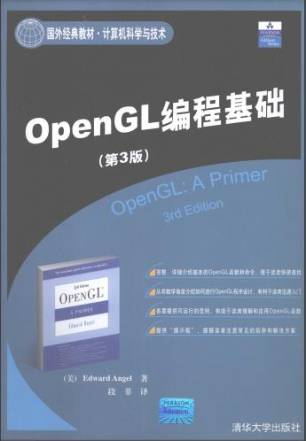

### OpenGL编程基础 示例代码



#### Ubuntu 16.04 安装opengl

```
sudo apt-get install build-essential libgl1-mesa-dev
sudo apt-get install freeglut3-dev
sudo apt-get install libglew-dev libsdl2-dev libsdl2-image-dev libglm-dev libfreetype6-dev
```
